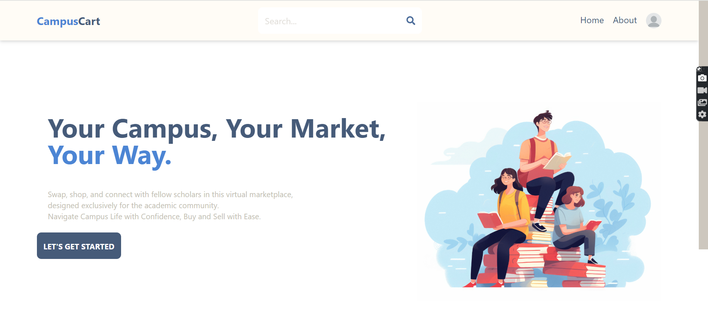
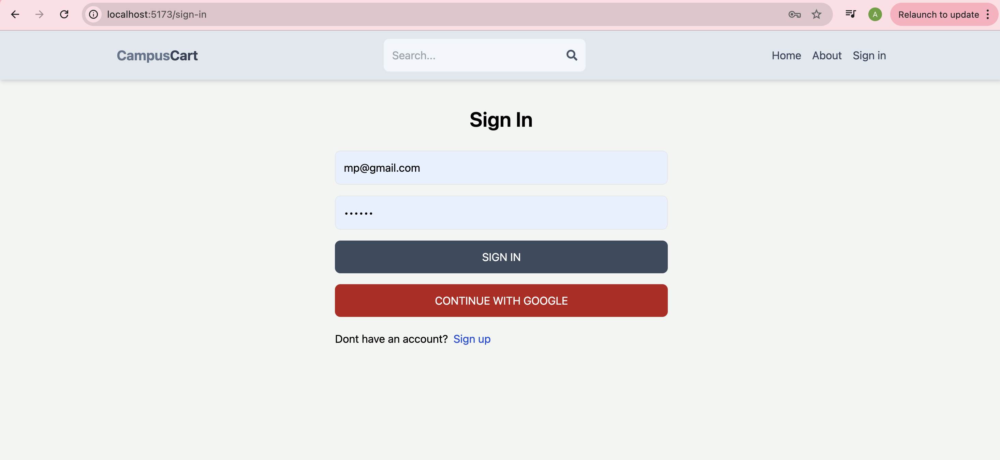

# Campus Cart

Campus Cart is my campus-focused marketplace where students can buy, sell, rent, and even report lost items. I built it as a MERN-stack project with a React + Vite frontend and an Express + MongoDB backend.

## Screenshots

### Home Page

### Login Page

## Features

- Student-focused marketplace to buy, sell, and rent items on campus
- Create detailed listings with images and item condition
- Lost and found section to post and search for lost items
- Authentication with email/password and Google sign-in
- User profile page to manage listings and account details
- Integrated chat so students can talk directly before completing a deal

## Tech Stack

- Frontend: React, Vite, Tailwind CSS, Redux Toolkit, Redux Persist
- Backend: Node.js, Express, MongoDB, Mongoose
- Auth and Storage: Firebase Authentication, Firebase Storage, JWT, cookies
- Realtime chat: Socket.io

## How to Run (Development)

1. Clone the repository and move into the main folder:
   - `cd CampusCart`

2. Install backend dependencies:
   - `npm install`

3. Install frontend dependencies:
   - `cd client`
   - `npm install`
   - `cd ..`

4. Configure environment variables:
   - Create a `.env` file inside `CampusCart` (same level as the `api` folder)
   - Add your MongoDB connection string as:
     - `MONGO=your_mongodb_connection_string`

5. Start the backend server:
   - From inside `CampusCart`:
   - `npm run dev`

6. Start the frontend (Vite dev server):
   - Open a new terminal
   - `cd CampusCart/client`
   - `npm run dev`

7. Open the app in the browser:
   - Vite will show a local URL (usually `http://localhost:5173`)
   - The backend runs on `http://localhost:3000`

## How to Build for Production

1. From inside `CampusCart`:
   - `npm run build`

2. This will:
   - Install dependencies
   - Build the React app inside `client`

3. Start the production server:
   - `npm start`

4. The backend will serve the built React app on port 3000.
